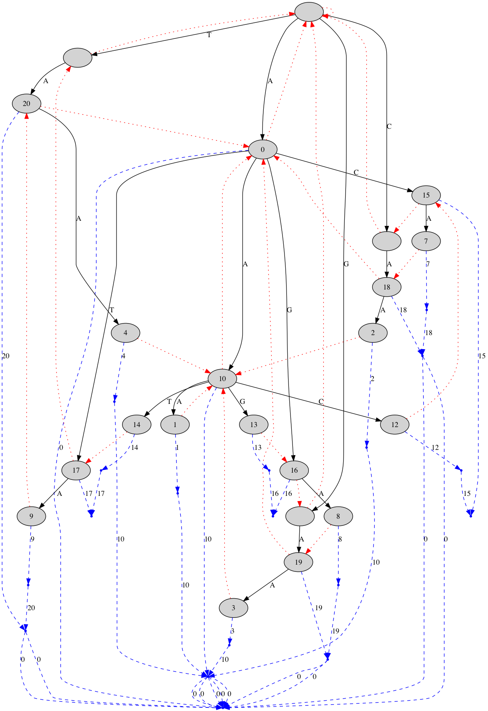

# Test tools

This directory contains various tools you might find useful for examining and testing your read-mappers. You can build all the tools by running

```sh
make
```

in this directory.

## edit_cloud

This tool builds the edit-cloud around a string. Using the `-d` option, you can specify the edit-distance to explore around the core string. Required positional options are: 
1. the alphabet to use for the exploration, provided as a string of characters, and 
2. the core string itself.

To see all strings one edit away from `AA` we can run:

```sh
$ ./edit_cloud -d 1 ACGT AA
```

This produces:

```
A 1I1M
AAA 1D2M
CAA 1D2M
GAA 1D2M
TAA 1D2M
A 1M1I
AAA 1M1D1M
ACA 1M1D1M
AGA 1M1D1M
ATA 1M1D1M
AA 2M
AAA 2M1D
AAC 2M1D
AAG 2M1D
AAT 2M1D
AC 2M
AG 2M
AT 2M
CA 2M
GA 2M
TA 2M
```

The output produces both the edit cloud and the corresponding CIGAR strings.

## display_trie

This tool creates a representation of a trie in the [Graphviz](https://www.graphviz.org) `dot` format and you can use it to display a trie over a set of patterns.

As input, it takes patterns in the form `edit_cloud` outputs. It writes the trie to the file `trie.dot` and you can then process this file with Graphviz.

When the same pattern appears more than once in the input—which it will because there are typically multiple ways to get to the same pattern by edits—the trie will not contain the duplications. The trie will be labelled with the number in which a pattern appears in the input, but not all patterns will necessarily be in the trie.

An example of running the program can look like this:

```sh
$ ./edit_cloud -d 1 ACGT AA > AA.patterns.txt
$ ./display_trie AA.patterns.txt
Building trie.
Computing failure links.
Printing trie graph to "trie.dot"
```

You can then display the result using the `dot` tool from Graphviz:

```sh
bash-3.2$ dot -Tpdf < trie.dot > trie.pdf
```

The result is this trie:



Failure links are shown in red and output-lists in blue.

## ac_search

This is a plain Aho-Corsick implementation. As input, it takes two files, a "database" file that simply contains a string to search in and a "patterns" file in the format outputted by `edit_cloud`.

```sh
$ echo ACAAGACA > database.txt
$ ./ac_search database.txt AA.patterns.txt
A	1I1M	at [0]: ACAAGACA
A	1M1I	at [0]: ACAAGACA
AC	2M	at [0]: ACAAGACA
ACA	1M1D1M	at [0]: ACAAGACA
CA	2M	at [1]: CAAGACA
A	1I1M	at [2]: AAGACA
A	1M1I	at [2]: AAGACA
CAA	1D2M	at [1]: CAAGACA
AA	2M	at [2]: AAGACA
A	1I1M	at [3]: AGACA
A	1M1I	at [3]: AGACA
AAG	2M1D	at [2]: AAGACA
AG	2M	at [3]: AGACA
AGA	1M1D1M	at [3]: AGACA
GA	2M	at [4]: GACA
A	1I1M	at [5]: ACA
A	1M1I	at [5]: ACA
AC	2M	at [5]: ACA
ACA	1M1D1M	at [5]: ACA
CA	2M	at [6]: CA
A	1I1M	at [7]: A
A	1M1I	at [7]: A
```

This tool takes into account that the same pattern can be reached by several different edits and keeps track of which CIGAR strings belong to which patterns, a one-to-many mapping that is needed to catch all occurrences of edits.

## display_match

This tool shows matches in a SAM file as local alignments against a reference genome. It takes the reference genome as its first argument and a SAM-file as its second:

```sh
$ ../mappers_src/ac_readmapper -d 1 ../data/gorGor3-small-noN.fa ../data/sim-reads-d2-tiny.fq | head -n 3 > ac.sam
$ ./display_match ../data/gorGor3-small-noN.fa ac.sam

Match: chr1 [at 7522] GGGCTAACAAG 5M1I5M
........GGGCTAACAAG........
...GGAAGGGGCT-ACAAGAGGCA...

Match: chr1 [at 7522] GGGCTAACAAG 6M1I4M
........GGGCTAACAAG........
...GGAAGGGGCTA-CAAGAGGCA...

Match: chr1 [at 20140] GGGCTAACAAG 7M1I3M
........GGGCTAACAAG........
...AGTAGGGGCTAA-AAGCATGT...
```